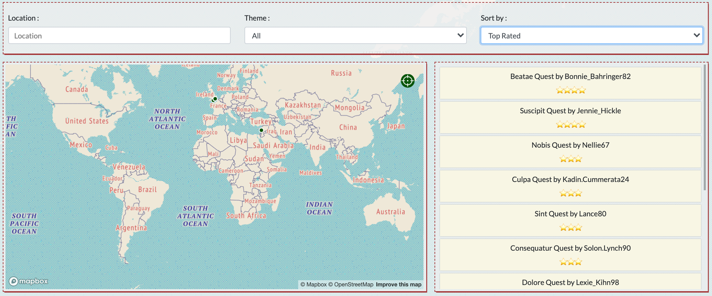

# SEI50 Project - ***popQuest***

## Application Outline
The popQuest app allows users to create and complete fun 'quests' within the city of their choosing. Each quest consists of a series of stops where the user must solve a clue in order to reveal the next stop. In some cases, the user device's coordinates will 'solve' the clue based on its proximity to a given location. Quests can be timed for those seeking a challenge, or simply a 'guided tour'-like trip for those interested in a more leisurely journey.

[Deployed App](https://popquest-app.herokuapp.com/)

## Project Brief
Collaborate remotely within a team of 4 to create a full-stack application. The application must include a React front end consuming data served from a Mongo database by an Express API. Complete the project within 9 days.

## Technologies Used

### Front End
* JavaScript
* React
* Node - SASS
* Boostrap
* Axios
* Mapbox-gl & Geocoder
* Cloudinary

### Back End
* Express
* MongoDB
* Mongoose
* Bcrypt
* Faker
* jsonwebtoken
* Insomnia

### Collaboration
* Git + Github
* Slack
* Trello

### Deployment
* Heroku

## Process
Once our team decided on an idea, we worked together to map the basic wireframing and models. We discussed the user stories and separated what we viewed as the core needs from extra features. We landed on the below user stories as the foundation (MVP) for our app.

User Stories:
* User can participate in quests without Login/Account
* Logged in user can create a profile
* Logged in user can rate & review completed quests
* Logged in user can create/delete quests, stops, clues/proximities
* Map is interactive, and responsive to user's location

Quest Index Wireframe:
<div align='center'>

</div>
Quest Show Wireframe:
<div align='center'>

</div>

Having completed those steps, we broke into 2 pairs with one focusing on the front end and other on the back. The full team met every morning for a standup session and planning, and often again in the evening to check in. We communicated throughout the day on Slack and kept a Trello board up to date to manage tasks and timelines. 

I primarily worked within the back end team to setup the initial models, routes and controllers for the app. I was also responsible for creating the script for seeding our database. I used Faker to create user profiles, reviews and quests consisting of 4 stops within the greater London area. 

``` javascript
const randQuests = []
      for (let quest = 0; quest < 5; quest++) {
        const stops = []
        const reviews = []
        const description = faker.lorem.sentence()
        const name = `Quest ${quest + 1}`
        const theme = ['Food & Drink', 'Sightseeing', 'Adventure', 'Speed'][Math.floor(Math.random() * 4)]
        const estTime = Math.max(Math.ceil(Math.random() * 60), 25)
        const location = {
          latitude: Number(faker.address.nearbyGPSCoordinate(['51.5074', '0.1278' ])[0]),
          longitude: Number(faker.address.nearbyGPSCoordinate(['51.5074', '0.1278' ])[1])
        }
        for (let stop = 0; stop < 4; stop++) {
          const name = `Stop ${stop + 1}`
          const location = {
            latitude: Number(faker.address.nearbyGPSCoordinate(['51.5074', '0.1278' ])[0]),
            longitude: Number(faker.address.nearbyGPSCoordinate(['51.5074', '0.1278' ])[1])
          }
          const clue = `Clue ${stop + 1}`
          const answerType = 'Answer'
          const answer = `Answer ${stop + 1}`
          const hint = `Hint ${stop + 1}`
          stops.push({
            name,
            location,
            clue,
            answerType,
            answer,
            hint
          })
        }
        randQuests.push({
          stops,
          name,
          description,
          theme,
          estTime,
          location,
          reviews
        })
      }
      randQuests.push( ...questData )
```

As the application took shape, the back end team was responsible for supporting any updates to how the data was served to front end. This involved minor tweaks to response bodies and controllers, as well as the models themselves. In the final days of the project, the team worked together to style, add finishing touches and test user stories. 

Quest Index:
<div align='center'>

</div>
Quest Show:
<div align='center'>

</div>

## Challenges, Bugs & Future Considerations

This was the first full-stack collaborative project I have had the opportunity to work on. Doing so remotely while learning Git/GitHub best practices presented a great opportunity and a few challenges. Early on, we dealt with several merge conflicts related to package installs. Our team worked well together to resolve and ensured a smooth process going forward. 

On the back end, while creating the models and controllers was fairly straightforward, new ideas or needs from the front end required adjustments to the models. This necessitated adjustments to the API and population of the response bodies, as well as the seed data and related seed.js file. Given more time, I would like to have created more detailed and relevant seed quests and users.

Additional challenges arose when the back end foundation was complete, and I moved into a role helping to create and finish the remaining front end components. This required ‘catching-up’ to the styling and syntax used by my teammates who were primarily building the front end. If given more time, we would have liked to spend it reviewing each other’s code to create a more uniform style (function declarations, variable naming, etc.).

## Key Takeaways

As mentioned above, working with a remote team on this app provided an opportunity for me to get more familiar with GitHub and the other collaborative tools we used. This included everything from communicating about new packages & working through merge conflicts to maintaining a Trello board to limit disruptions and organize our tasks and timelines. Overall, it was exciting to see how quickly the app took shape with each team member working through their tasks. As the first full stack project I have worked on to completion, it was a very enlightening experience to see how different technologies in the MERN stack relate to form a complete application.

